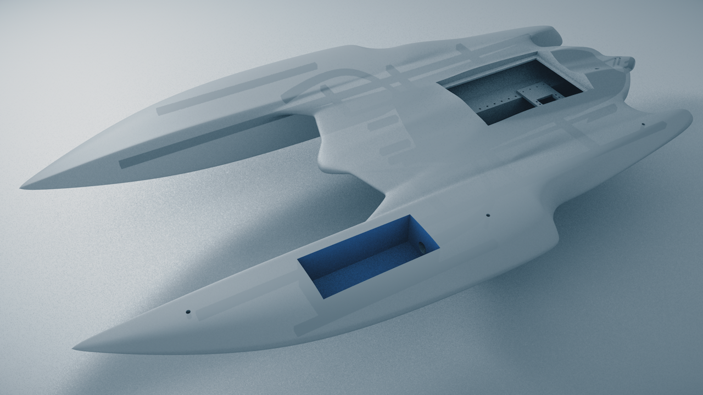

# Barco-Solar-2022

Hemos creado de nuevo (<a href="https://www.amiguslabs.org/portfolio_page/barco-solar/" target="_blank">Barco 2018</a> -  <a href="https://www.amiguslabs.org/portfolio_page/amigus-labs-barco-solar19/" target="_blank">Barco 2019</a>) un barco impreso en 3d para participar en la <a href="http://regatasolar.org" target="_blank">Regata Solar de Marine Instruments</a>. Esta vez un trimaran de unos 9Kg de peso y un volumen total de 29 litros.

Se ha diseñado integramente en Cinema 4D, con subdivisión de superficies (curvas Nurbs).

Una vez modelado, se han dividio en 32 piezas para imprimir, secciones de hasta 250x250x200mm y exportado a STL. Para optimizar la impresión intentamos que cada sección no tardase más de 10 horas en imprimirse, para intentar imprimir por el dia y dormir por la noche :P El software de slicer usado es el Simplify3D y la impresora una Ender 5 Plus.

Evitanto el uso de soportes a la hora de imprimir se han hecho algunas secciones que finalmente se pegan para poder imprimir sobre el lado más plano y evitar luego el postprocesado.

Una vez impresas las piezas, y para facilitar la rigidez a la hora de pegarlas, se han hecho unas secciones en cada pieza para pegar y encajar unos pequeños tubos impresos de unos 10x10x50mm. Se ha pegado todas las partes con pegamento para modelismo comprado en bazar chino, tarda unas 4 horas en secar y quedan las piezas muy rígidas. En las zonas que por sharping de las piezas hizo falta se relleno de masilla para carrocerías de Ceys. 

Para darle el acabado final, una vez pegadas todas las piezas, se ha aplicado imprimación de color blanco y posteriormente una mano de Epoxi. En el montaje, en las zonas más irregulares se le aplicó un poco de lijado.

Para encajar las partes de electrónica al barco, así como el soporte de la placa solar, se han usado unos insertos de M5 y M3 aplicados con solador, que evitan el uso de tuercas y hacen que las zonas de enrosque queden bien sujetas.

## Electrónica

Hemos intentado hacer una nueva PCB partiendo de un Attiny1614. Se ha diseñado la pcb en KiCAD, integrando un sensor INA219 para la optimización del voltaje y potencia de la placa solar basandonos en la propuesta de <a href="https://github.com/aindustriosa/Solar_MPPT_board" target="_blank">A Industriosa</a> del año 2019.

Con los limites de potencia y memoria del Attiny1614, hemos implementado el uso del sensor así como un divisor de voltaje para leerlo via VREF. Los mensajes enviados desd eel mando RC al receptor, son procesados por el microcontrolador y en caso de exigirle una velocidad mayor al 30% entra en modo automático, y prioriza el rendimiento que este generando la placa solar en ese momento a optener la velocidad optima sin permitir la caida de potencia por un exceso del rendimiento de la placa solar.

## Materiales

8x PETG 1Kg Blanco 1.75mm (<a href="https://www.amazon.es/dp/B08C4YP5RS/ref=twister_B08HSFRV2M?_encoding=UTF8&th=1" target="_blank">Amazon</a>)

1x Smartfil FLEX - Filamento Flexible (<a href="https://www.smartmaterials3d.com/flex-filamento#/1-tamano-s_330g/26-diametro-175_mm/29-color-sapphire" target="_blank">Smart Materials 3D</a>)
  
3x Tubos cuadrados de 10x10x500mm - <a href="https://www.clipcarbono.com/es/home/947-tubo-exterior-cuadrado-10x10-mm-interior-cuadrado-8x8-mm-de-fibra-de-carbono-longitud-1000-mm.html" target="_blank">Tubo cuadrado, exterior (10x10 mm.) - interior (8x8 mm.) de fibra de carbono - Longitud 1000 mm.</a> Cortesía de <a href="https://www.clipcarbono.com" target="_blank">ClipCarbono</a>

1x Castropox 4307/1209 Resina Epoxi de usos generales (<a href="https://www.castrocompositesshop.com/es/resinas/1099-resina-epoxi-castropox-43071209.html" target="_blank">Castro Composites</a>)

1x Massilla Caarrocerias Ceys (<a href="https://www.amazon.es/Desconocido-M59016-Adhesivo-masilla-carrocerias/dp/B00ITVXML6" target="_blank">Amazon</a>)

3x Imprimación Plástico (<a href="https://www.amazon.es/MTN-IMPRIMACIÓN-PLÁSTICOS-400-ML/dp/B00WG2K6W2/ref=sr_1_15?__mk_es_ES=ÅMÅŽÕÑ&crid=2E2QZXNCDXAI6&keywords=imprimacion&qid=1655512005&sprefix=imprimacion%2Caps%2C124&sr=8-15" target="_blank">Amazon</a>)

1x soporte helice y timon (<a href="https://es.aliexpress.com/item/32901476708.html" target="_blank">Aliexpress</a>)

100x Inserto roscado M3 (<a href="https://www.amazon.es/gp/product/B08BCRZZS3/ref=ppx_yo_dt_b_asin_title_o00_s00?ie=UTF8&th=1" target="_blank">Amazon</a>)

6x Inserto roscado M5 (<a href="https://www.amazon.es/gp/product/B07YSVXWS8/ref=ppx_yo_dt_b_asin_title_o00_s00?ie=UTF8&th=1" target="_blank">Amazon</a>)

1x Acoplamiento Motor 4x5mm (<a href="https://www.amazon.es/gp/product/B09LV3KD4H/ref=ppx_yo_dt_b_asin_title_o05_s00?ie=UTF8&th=1" target="_blank">Amazon</a>)

1x Motor NTM Prop Drive 28-30 800KV (<a href="https://hobbyking.com/es_es/propdrive-v2-2830-800kv-brushless-outrunner-motor.html" target="_blank">Hobbyking</a>)

1x Turnigy Multistart 20A V2 ESC (<a href="https://hobbyking.com/es_es/turnigy-multistar-20a-v2-esc-with-blheli-and-4a-lbec-2-6s.html" target="_blank">Hobbyking</a>)

## Enlaces

- <a href="http://regatasolar.org" target="_blank">Regata Solar de Marine Instruments</a>
- <a href="https://www.amiguslabs.org" target="_blank">Amigus Labs</a>
- <a href="https://www.clipcarbono.com" target="_blank">ClipCarbono</a>
- <a href="http://aindustriosa.org" target="_blank">A Industriosa</a>
- <a href="https://fablableon.org" target="_blank">Fab Lab León</a>
- <a href="https://www.esne.es" target="_blank">ESNE</a>

